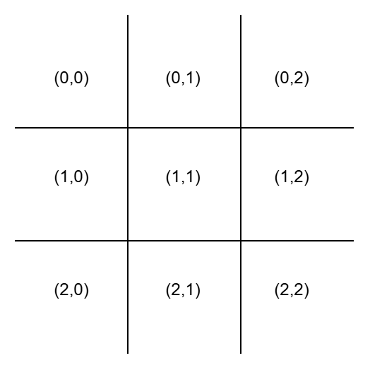

## Deep-Q-Learning
Deep Q-Learning is a type of Reinforcement Learning (RL) algorithm. It combines Q-Learning (a classic RL algorithm) with Deep Neural Networks to help an agent learn how to make decisions in an environment

- Goal: The `agent learns to take actions` that maximize its cumulative reward over time.

- How: It uses a `neural network` to `approximate the Q-values` (which represent how good an action is in a given state).

**Key Concepts:**

1. `Agent and Environment`:
    - The agent is the learner or decision-maker
    - The environment is the world the agent interacts with (e.g., a game, a robot’s surroundings).

2. `State (s)`:
    - A state represents the `current situation` of the `agent` in the environment.
    - Example: In a game, the state could be the position of the player.

3. `Action (a)`:
    - An action is a move the `agent` can `take` in a given state.
    - Example: In a game, actions could be "move left," "move right," etc.

4. `Reward (r)`:
    - A `reward` is feedback the `agent gets` after taking an action in a state.
    - Example: If the agent reaches a goal, it gets a positive reward (+10). If it hits an obstacle, it gets a negative reward (-1).

5. `Q-Value (Q(s, a))`:
    - The Q-value represents how good an action *a* is in a state *s*
    - It is the expected cumulative reward the agent will get if it takes action *a* in state *S* and follows the optimal policy afterward.

6. `Policy`:
    - A policy is a `strategy` the `agent` uses to decide which action to take in a given state.
    - The `goal` is to `learn` the `optimal policy` that `maximizes` the cumulative `reward`.

## Let's look at the mathmetical terms.

1. Q-Learning Basics:
In classic Q-Learning, the agent learns a Q-table that stores Q-values for every state-action pair. The Q-table is updated using the Bellman Equation:

$$Q(s, a) = Q(s, a) + \alpha \left[ r + \gamma \max_{a'} Q(s', a') - Q(s, a) \right]$$

$$\left( \sum_{k=1}^n a_k b_k \right)^2 \leq \left( \sum_{k=1}^n a_k^2 \right) \left( \sum_{k=1}^n b_k^2 \right)$$

Where:
- ( Q(s, a) ): Current Q-value for state ( s ) and action ( a ).
- alpha : Learning rate (how quickly the agent learns).
- ( r ): Reward received after taking action \( a \) in state \( s \).
- ( gamma ): Discount factor (how much the agent cares about future rewards).
- ( max_{a'} Q(s', a') ): Maximum Q-value for the next state \( s' \).


## Example

 A 3x3 grid world.

- The agent starts at the top-left corner(0,0).

- The goal is at the bottom-right corner(2,2).

- The agent can move up, down, left, or right.

- If the agent reaches the goal, it gets a reward of +10. If it hits a wall, it gets a reward of -1.

Objective: The agent learns to navigate the grid to reach the goal in the fewest steps.

### 3x3 grid 


### Define the Environment (GridWorld)
In this Grid World class, three key functions—init, reset, and step—serve as the core components of the environment.

---

### Python Version and Requirements

This project uses **Python 3.12.0**. To install the required packages, run the following command:

```bash
pip install -r requirements.txt
```

---

 Below check the Information About the  class `GridWorld`
<details>
<summary>Init function</summary>
Initializes the environment, setting up the initial state and parameters.

- Defining Grid 3*3 using `numpy`
- Defining Goal and state

</details>

<details>
<summary>Reset</summary>
 Resets the environment to its starting state, allowing for a fresh episode.

- Reset the state 
- start from the begining `(0,0)`

</details>

<details>
<summary>Step</summary>
Advances the environment by taking an action and returning the new state, reward, and whether the episode has ended.

- 0 for go up, 1 for down, 2 left, 3 right
- After move , check the state reached the goal or not
- if Target reached get `positive` `reward` and `Done` 
- if not reached `negetive` `reward` and ` not Done` 

</details>

### Define the DQL Agent (DQLAgent)

**Bellman Equation**:
$$
Q_{\text{target}}(s, a) = r + \gamma \cdot \max_{a'} Q(s', a')
$$

**Where:**
- Q_target(s, a) is the target Q-value for state s and action a.
- r is the reward received after taking action a.
- γ (gamma) is the discount factor.
- max_a' Q(s', a') represents the maximum predicted Q-value for the next state s' across all possible actions a'.

<details>
<summary>Init Function</summary>

The Init function initializes the agent's parameters, including memory, learning rates, and exploration settings. It also constructs the neural network model.

- Accepts inputs: `(state_size, action_size)`
- Utilizes a `deque` to store experience memory
- Sets the discount factor: `gamma = 0.95`
- Initializes the exploration rate: `epsilon = 1`
- Constructs the model using a neural network architecture

</details>

<details>
<summary>Neural Network Model</summary>

This section describes the architecture of the neural network model used by the agent.

- Uses a **Sequential** model to build the neural network layer by layer.
- Adds a **Dense** input layer with:
  - **Input Dimension**: `state_size`
  - **Activation Function**: `relu`
- Adds a **Dense** hidden layer with:
  - **Units**: 24
  - **Activation Function**: `relu`
- Adds a **Dense** output layer with:
  - **Units**: `action_size`
  - **Activation Function**: `linear`
- Compiles the model with:
  - **Loss Function**: Mean Squared Error (`mse`)
  - **Optimizer**: Adam with a specified learning rate

The model is designed to approximate the Q-values for the given state-action pairs.

</details>

<details>
<summary>Remember</summary>

- Store in Memory about `state` ,`action`, `reward`, `next_state` and `done`
 
</details>


<details>
<summary>Act Function</summary>

The `act` function determines the action the agent will take based on its current state and exploration settings.

- **Parameters**:
  - `state`: The current state of the environment, represented as an array.

- **Functionality**:
  - **Exploration vs. Exploitation**:
    - The function first checks if a random value is less than or equal to `epsilon` (the exploration rate).
    - If true, the agent explores by selecting a random action from the available action space (up, down, left, right).
  - **Exploitation**:
    - If the random value exceeds `epsilon`, the function reshapes the state to fit the model's input requirements.
    - It then predicts the Q-values for the given state using the neural network model.
    - Finally, it selects the action corresponding to the maximum Q-value from the predicted values.

This function balances exploration and exploitation, enabling the agent to learn effectively over time.

</details>

<details>
<summary>Replay Function</summary>

The `replay` function enables the agent to learn from its past experiences stored in memory by performing experience replay.

- **Parameters**:
  - `batch_size`: The number of experiences to sample from memory for training.

- **Functionality**:
  - **Memory Check**:
    - The function first checks if the current memory size is less than the specified `batch_size`. If it is, the function exits early to ensure there are enough experiences to sample.
  
  - **Minibatch Sampling**:
    - A random sample (minibatch) of experiences is drawn from memory, consisting of tuples: `(state, action, reward, next_state, done)`.

  - **Experience Processing**:
    - For each experience in the minibatch:
      - The `target` variable is initialized to the `reward`.
      - If the episode is not done, it reshapes `next_state` and calculates the target using the Q-learning formula:
        - `target = reward + gamma * max(Q(next_state))`
      - The current `state` is reshaped for model input.
      - The model predicts the current Q-values (`target_f`) for the state.
      - The Q-value corresponding to the action taken is updated with the computed `target`.
      - The model is then trained on this updated Q-value using a single epoch.

  - **Epsilon Decay**:
    - After processing the minibatch, if `epsilon` is greater than `epsilon_min`, it decays `epsilon` by multiplying it with `epsilon_decay` to reduce exploration over time.

This function plays a critical role in enabling the agent to learn from its past actions and improve its decision-making capabilities.

</details>